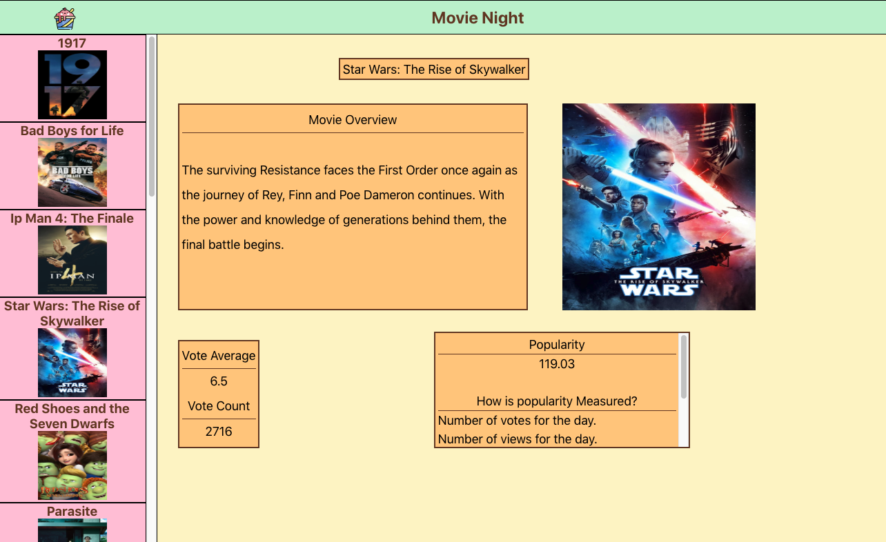
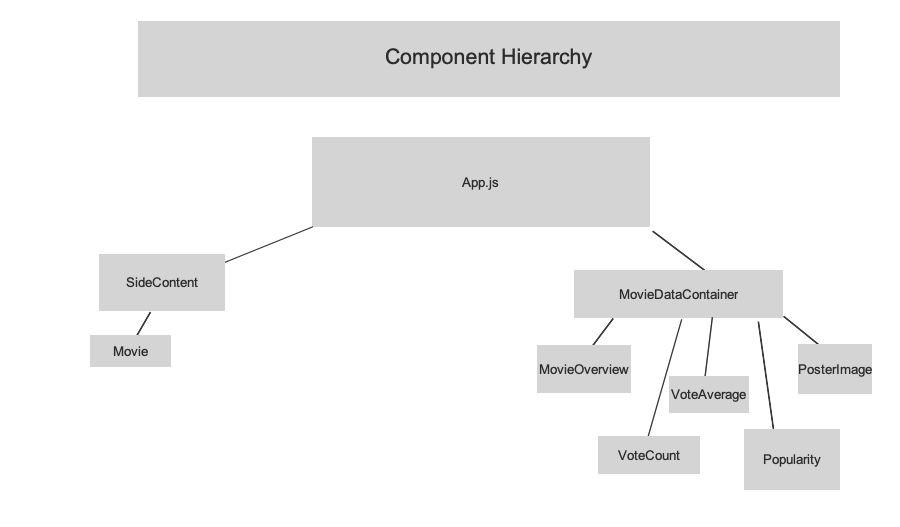
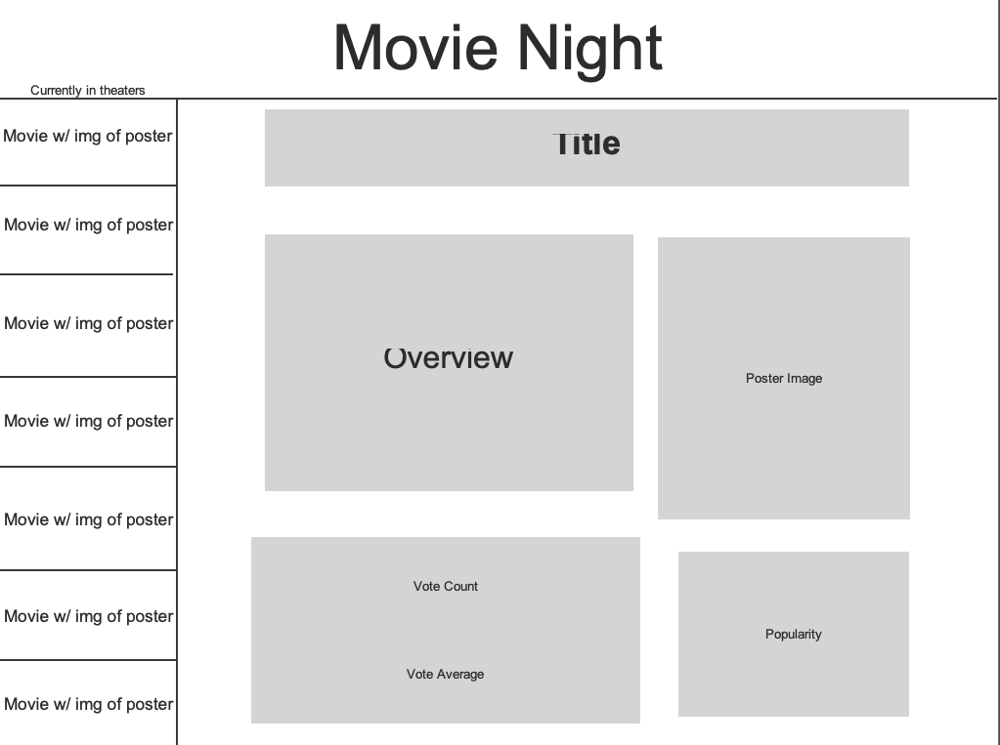

# Movie Night App

## About Movie Night App

The Movie Night App was created to solve an issue that has plagued my life for years. I love watching movies in theaters, but how do you know the movie you want to see is any good? Is it worth your time? What is the movie even about? This app can answer all of those questions, and prevent you from wasting your time seeing a bad movie.

## Wireframe and Planning

I used Justinmind to create both the component heirarchy and the application layout. Wireframing is something that is new for me. In past projects, I would just have an idea in my head of what I think an application should look like. It's easy in smaller projects to make excuses and not use any wireframing. But as the scopes of the projects increase, so too will the need to properly prepare and wireframe out designs.

## Technical Specifications

This application was created using React, and React Router. API data used in the application was provided by MovieDB and deployment of was achieved using Heroku.

## Accessing the application

You can find the application deployed via Heroku at the following address:

https://movie-night-cw.herokuapp.com/

If you would like to play around with the code locally, you can also clone the repo here:

https://github.com/chrisrw/movie-night

## Usage

It's friday night, you want to see a movie with a loved one, but threaten you saying "if you pick another bad movie, you don't get to pick movies for us to watch anymore!" Frightened, you start to look for movies to watch and the associated reviews for them. You pull up aggregated movie review sites and think to yourself "there is too much stuff happening on this website, I need concise information about movies that are in theaters!"

Just then, you notice your computer monitor lights up brightly. It navigates to the "movie-night-cw" app on Heroku. You notice it's an aesthetically pleasing and simple application that will give you the tools to make an informed movie selection decision.

Don't let your loved one take the power of choosing movies away from you. Keep that power, with the Movie Night App.

## Future Directions

For me, this application contains all of the features it needs to serve its purpose. Adding any functional changes would not neccesarily improve the Movie Night application. Improvements to this application would lie solely in the user experience. CSS and design are admittedly weaker areas that I aim to improve upon in the future. In the future, I would love to make some aesthetic changes to make the project better to look at, and thus improve the experience of the user.
